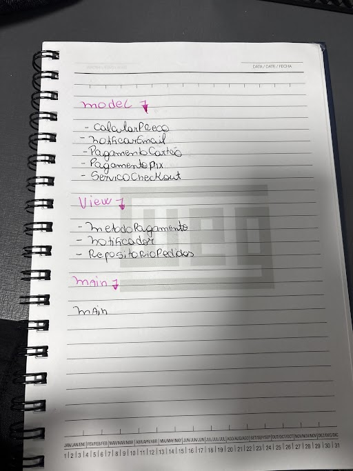

== 🎁Trabalho Bônus

*Integrantes*

* ** 👩‍💻Hellen Gabriela Scarantti **
* ** 🧑‍💻Vitor Eduardo Eleoterio **

*🎯O que é Solid?*

O SOLID é um conjunto de 5 princípios de programação que ajudam a criar códigos mais organizados, fáceis de entender e modificar. O SRP (Princípio da Responsabilidade Única) diz que cada classe deve ter uma única responsabilidade, facilitando a manutenção. O OCP (Princípio Aberto/Fechado) recomenda que o código seja aberto para a adição de novas funcionalidades, mas fechado para modificações, permitindo a expansão sem alterar o código existente. O LSP (Princípio de Substituição de Liskov) garante que ao substituir uma classe por outra, o programa continue funcionando corretamente. O ISP (Princípio da Segregação de Interface) sugere que interfaces grandes sejam divididas em partes menores e específicas, evitando que classes implementem métodos que não são utilizados. Por fim, o DIP (Princípio da Inversão de Dependência) afirma que devemos depender de abstrações (interfaces) em vez de implementações concretas, tornando o código mais flexível e fácil de testar.

*📊Diagrama simples*

